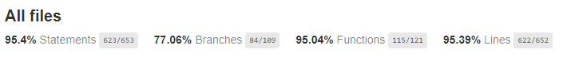

# Team.Up - backend, v.1.0.0

## Description
Ever wanted to find a team to play some football or find a partner to go to gym? Team.Up allows you to do so! Create your own sport event or join existing one and keep up your healthy lifestyle!

Team.Up backend application is created in Express.js and uses MongoDB. It is built on top of three-layer architecture.

### Frontend URL
Frontend is available here: https://github.com/hejs22/team.up-ui

## Features

### What can user do?

- create account, sign in and sign out,
- authenticate with usage of JWT,
- refresh set of auth tokens,
- access own details,
- access list of sport disciplines,
- access list of sport events,
- create own sport events,
- modify or delete sport events created by that user.

### What can admin do?

- everything user can do,
- access list of users' details,
- change other users' roles,
- add, modify or delete sport disciplines,
- modify or delete sport events created by anyone.

### Additional implemented things

- Migrations system,
- Integration tests with usage of Jest,
- High code coverage of each use case,
- Configuration via envs,
- OpenAPI,
- Logger.

## Coverage

## OpenApi
https://app.swaggerhub.com/apis/HCYWKA/TeamUp/1.0.0